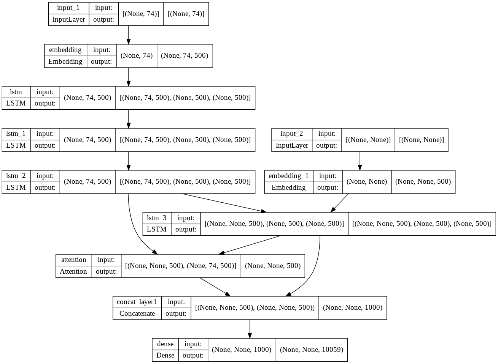

# About

An Abstractive text summarizer trained using lstm based sequence to sequence model with attention mechanisim. The attention model is used for for generating each word of the summary conditioned on the input sentence.

- Used amazon fine food review dataset for training
    - dataset taken from kaggle (https://www.kaggle.com/snap/amazon-fine-food-reviews)

### Training Model Overview

### Local setup

- download this repo
- create a virtual env , pip install the requirements.txt
- then from inside the virtual env and the directory, run `streamlit run app.py`.
- provide the long input text in the text area and submit ,it should give the short summary.
