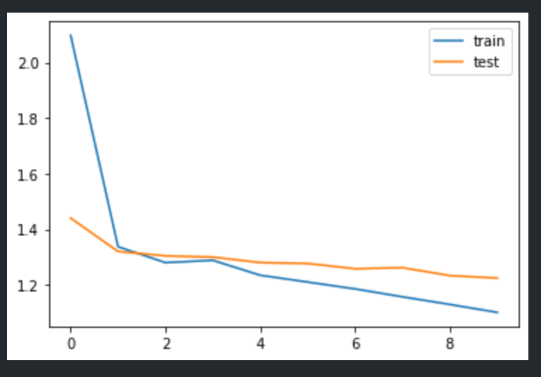

# About

An Abstractive text summarizer trained using lstm based sequence to sequence model with attention mechanisim. The attention model is used for for generating each word of the summary conditioned on the input sentence.

- Used amazon fine food review dataset for training
    - dataset taken from kaggle (https://www.kaggle.com/snap/amazon-fine-food-reviews)

### Training Model Overview

